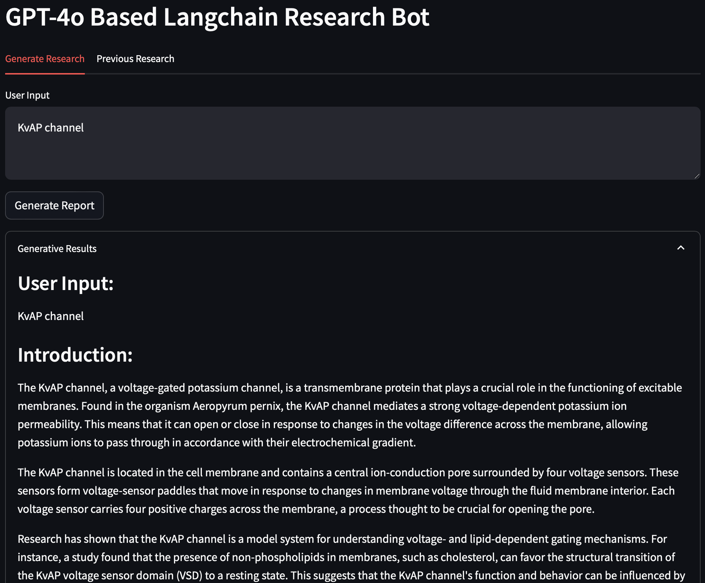
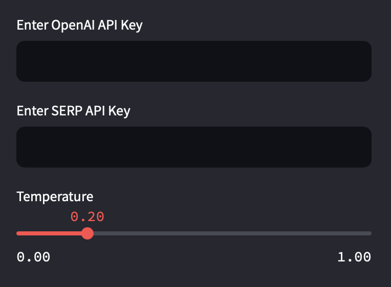
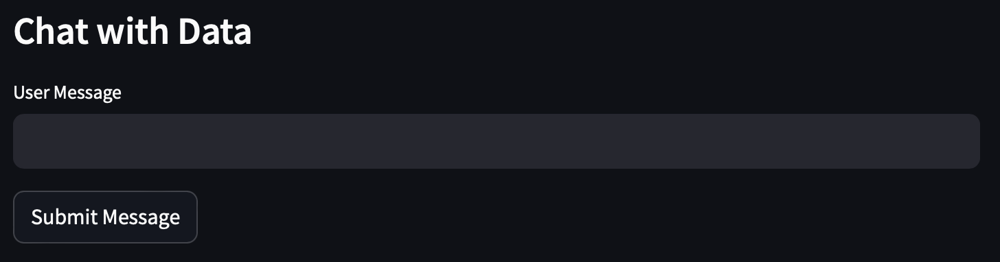
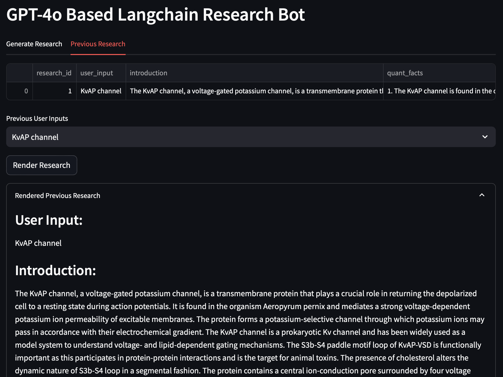

# A Web App for Protein Research Using Langchain Agents



## Introduction

With the availability of the OpenAI API and the versatility of the Langchain package for building LLM agents, creating specialized multi-agent tools has become easier than ever. In this blog post, I will show you how I built a multi-agent web application for protein research using Langchain and the GPT model. This application leverages Langchain agents to streamline the research process, focusing specifically on protein research. By integrating multiple data sources and tools, it provides a comprehensive platform for generating and accessing protein-related research effortlessly.

For this project, I chose the OpenAI GPT-4o as the language model and utilized Langchain to design the agents. The application employs five different agents to perform various research tasks, ensuring a thorough and efficient research process. Built with Streamlit, this web application offers a user-friendly interface and robust functionality. Detailed implementation can be found in the GitHub repository. (https://github.com/nidhinthomas-ai/langchain_agents_research_bot). 

This web application was based on the original work from Peter Martens (https://github.com/petermartens98/GPT4-LangChain-Agents-Research-Web-App)

### Pre-requisites:

### Downloading the Repository:
Clone the repository from GitHub to your local machine:

```bash
git clone https://github.com/nidhinthomas-ai/langchain_agents_research_bot
cd langchain_agents_research_bot-main
```

### Repository Layout:

The repository is organized as follows:
```bash
PepBot-main/  
├── main.py
├── README.md
├── assets/
│   ├── Research_Bot.png  
│   ├── Sidebar.png 
│   ├── Interface.png  
│   ├── Chat_with_data.png 
│   └── Prev_Research.png
├── langchain_community/
│   ├── tools/
│   │   ├── uniprot/
│   │   │   ├── __init__.py  
│   │   │   └── tool.py
│   ├── utilities/
│   │   └── uniprot.py 
├── .env 
├── google_scholar 
└── requirements.txt 
```

### Creating a Conda Environment:
To ensure compatibility and manage dependencies, it is recommended to create a new conda environment for this project:

```bash
conda create --name researchbot python=3.10
conda activate researchbot
```

### Install required packages:
```bash
pip install -r requirements.txt
```

### .env file:

The .env file contains the API Key:

```bash
OPENAI_API_KEY="Your_OPENAI_API_KEY"
SERP_API_KEY="Your_SERP_API_KEY"
```

**WARNING:** The API Key you create is unique to a user and a project, and must be kept private and not shared with anyone.

### To Launch the App:

```bash
streamlit run main.py
```

## Database Functions

We use the SQLite database in the application. The database stores information related to research queries and their results, ensuring that previous research can be accessed and referenced easily.  

## List of Agents

The web application utilizes several Langchain agents, each specialized for different research tasks:  

**Wikipedia Research Tool:** This agent fetches information from Wikipedia, providing a quick overview and detailed descriptions of proteins and related topics.  
**Pubmed Science and Medical Journal Research Tool:** Accesses PubMed, a database with over 35 million citations, to retrieve relevant biomedical literature.  
**Google Scholar Search Tool:** Searches Google Scholar for research articles, offering links to academic papers and their abstracts.  
**UniProt Protein Information Tool:** Provides detailed protein-specific information from UniProt, including function, organism, amino acid sequence, and available PDB structures.  
**Vector-Based Previous Research Database Tool:** Utilizes a vector database to provide access to previously generated research results, enhancing the continuity of research efforts.  

### UniProt Tool

I have created a API wrapper for UniProt database specifically for this tool. It fetches data from UniProt based on the query. You can copy the sub directories within langchain_community module in the github repository and effectively use it as an API wrapper. 

```bash
├── langchain_community/
│   ├── tools/
│   │   ├── uniprot/
│   │   │   ├── __init__.py  
│   │   │   └── tool.py
│   ├── utilities/
│   │   └── uniprot.py 
```

### Sidebar

I have added options to enter the API keys and choose the temperature of the GPT-4o model. You can either enter the .env file or enter the keys in the app itself. 



## Chat with Data

One of the standout features of this application is the "Chat with Data" functionality. Users can input their queries in natural language, and the application responds with relevant information sourced from the integrated agents. This interactive approach allows researchers to obtain precise and comprehensive answers to their questions, whether they are looking for detailed protein information, recent publications, or quantitative data. Once the Bot generates the data, users can interact with the data by asking follow-up questions. 

For instance, by asking, "Provide detailed information about the GLP-1 peptide," the application will collate data from Wikipedia, UniProt, PubMed, and Google Scholar, presenting a holistic view of the peptide, including its function, related studies, and key statistics.  



## Previous Research

The application also features a "Previous Research" tab, which displays a database of past research queries and their results. This is particularly useful for researchers who want to revisit their previous work or build upon it. The data is stored in an SQLite database, and users can select from a list of previous queries to view detailed research reports, including introductions, quantitative facts, related publications, and recommended books.  

This functionality ensures that valuable research data is not lost and can be easily accessed and referenced in future projects.  



## Caveats

While the Research Bot is a powerful tool, there are some caveats to keep in mind:  
  
**Data Limitations:** The quality and comprehensiveness of the information retrieved depend on the sources accessed by the agents. Sometimes, the latest or niche research articles might not be immediately available.  
**Agent failure:** The application relies completely on the efficacy of the agents. Their success is dependent on the prompts and how well the data can be parsed. It sometimes fails to parse the data properly and therefore fails to provide complete data. With multiple iterations, it may work.  
**API Key Management:** Users need to manage their OpenAI and SERP API keys. These keys can be entered directly into the application or loaded from an .env file. Ensuring the security and validity of these keys is crucial. For now, these API keys need to be provided for the tool to function properly.

## Conclusion

This Web Application for protein research represents a significant advancement in how researchers can access and compile data using Larget Language Models. By integrating multiple Langchain agents and offering interactive, data-driven chat capabilities, this web application simplifies the research process, making it more efficient and comprehensive. While there are some limitations to consider, the overall utility and potential of this tool are immense, paving the way for more streamlined and effective research in the field of biotechnology.

This tool is an example of how modern AI and natural language processing technologies can be harnessed to support scientific research, ultimately contributing to faster and more informed discoveries. Whether you are a seasoned researcher or a student beginning your journey in protein research, this application provides a robust platform to aid your work. This tool can be further re-purposed conduct research on specific topics. Feel free to modify the tool to build your own web application. 